<div>

<table>
<tbody>
<tr class="odd">
<td>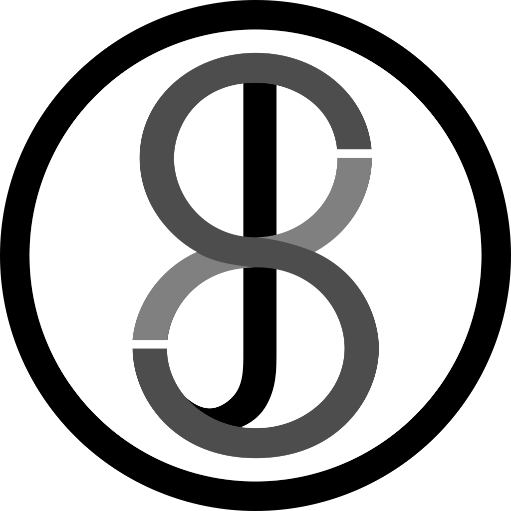</td>
<td><p><span id="anchor"></span><span id="anchor-1"></span>JS8Call de KN4CRD</p><p>2026-01-18 - v2.2+ 
<!-- TODO: change to User Guide release date following approval and remove 'partially updated' warning below | assignee: @Aqueum --> </p></td>
</tr>
</tbody>
</table>
**This is a partially updated version of the v2.2 User Guide.  Links have been fixed/updated so it is slightly more useful than the v2.2 original**
<hr>
 JS8Call is an experiment in combining the robustness of FT8 (a weak-signal mode by K1JT) with a messaging and network protocol layer for weak signal *communication*. The open source software is designed for connecting amateur radio operators who are operating under weak signal conditions and offers real-time keyboard-to-keyboard messaging, stored (inbox) messaging, message relay, and automatic station announcements. JS8Call is heavily inspired by [WSJT-X](https://wsjt.sourceforge.io/wsjtx.html), [Fldigi](http://www.w1hkj.org/), and [FSQCall](http://www.qsl.net/zl1bpu/MFSK/FSQweb.htm) and would not exist without the hard work and dedication of the many developers in the amateur radio community.

<p>

**JS8Call stands on the shoulders of giants...the takeoff angle is better up there.**
<p>

<hr>
<center>Read more on the original [design inspiration here.](https://github.com/jsherer/ft8call)</center>

<center>For release announcements and discussion, join the JS8Call mailing list here: [https://groups.io/g/js8Call](https://groups.io/g/js8call)
</center>
<hr>

<center>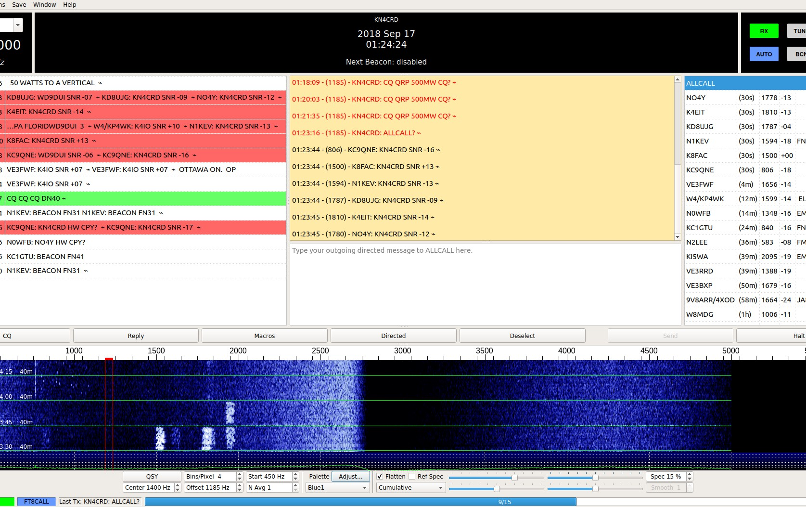

 © 2020 Jordan Sherer - This work is openly licensed via [*CC BY-SA*](https://creativecommons.org/share-your-work/cclicenses/).
</center>
</div>

 ## History

- **July 6, 2017** - The initial idea of using a modification to the FT8 protocol to support long-form QSOs was developed by Jordan, KN4CRD, and submitted to the WSJT-X mailing list: [https://sourceforge.net/p/wsjt/mailman/message/35931540/](https://sourceforge.net/p/wsjt/mailman/message/35931540/)

- **August 31, 2017** - Jordan, KN4CRD, did a little development and modified WSJT-X to support long-form QSOs using the existing FT8 protocol: [https://sourceforge.net/p/wsjt/mailman/message/36020051/](https://sourceforge.net/p/wsjt/mailman/message/36020051/)

  He sent a video example to the WSJT-X group: [https://widefido.wistia.com/medias/7bb1uq62ga](https://widefido.wistia.com/medias/7bb1uq62ga)

- **January 8, 2018** - Jordan, KN4CRD, started working on the design of a long-form QSO application built on top of FT8 with a redesigned interface.

- **February 9, 2018** - Jordan, KN4CRD, submitted question to the WSJT-X group to see if there was any interest in pursuing the idea: [https://sourceforge.net/p/wsjt/mailman/message/36221549/](https://sourceforge.net/p/wsjt/mailman/message/36221549/)

- **February 10, 2018** - Jordan KN4CRD, Julian OH8STN, John N0JDS, and the Portable Digital QRP group did an experiment using FSQ. The idea of FT8Call, combining FT8, long-form QSOs, and FSQCall like features was born.

- **February 11, 2018** - Jordan, KN4CRD, inquired about the idea of integrating long-form messages into WSJT-X: [https://sourceforge.net/p/wsjt/mailman/message/36223372/](https://sourceforge.net/p/wsjt/mailman/message/36223372/)

- **February 12, 2018** - Joe Taylor, K1JT, wrote back: [https://sourceforge.net/p/wsjt/mailman/message/36224507/](https://sourceforge.net/p/wsjt/mailman/message/36224507/) saying no and "Please don\'t let my comment discourage you from proceeding as you wish, toward something new."

- **March 4, 2018** - Jordan, KN4CRD, published a design document for FT8Call: [https://github.com/jsherer/ft8call](https://github.com/jsherer/ft8call)

- **July 6, 2018** - Version 0.0.1 of FT8Call released to the development group

- **July 15, 2018** - Version 0.1 released - a dozen testers

- **July 21, 2018** - Version 0.2 released - 75 testers

- **July 27, 2018** - Version 0.3 released - 150 testers

- **August 12, 2018** - Version 0.4 released - (["leaked" on QRZ](https://forums.qrz.com/index.php?threads/a-new-ft8-with-qso-and-rag-chew-capabilities-called-ft8call.623882/)) - 500 testers

- **September 2, 2018** - Version 0.5 released - 3000 testers

- **September 14, 2018** - Version 0.6 released - 5000 testers

- **October 8, 2018** - Version 0.7 released - 6000 testers, name changed to JS8 & JS8Call

- **October 31, 2018** - Version 0.8 released - \~7000 testers

- **November 15, 2018** - Version 0.9 released - \~7500 testers

- **November 30, 2018** - Version 0.10 released - \~7800 testers

- **December 18, 2018** - Version 0.11 released - \~8200 testers

- **January 1, 2019** - Version 0.12 released - \~9000 testers

- **January 23, 2019** - Version 0.13 released - \~9250 testers

- **February 7, 2019** - Version 0.14 released - \~9600 testers

- **February 21, 2019** - Version 1.0.0-RC1 released - \~10000 testers

- **March 11, 2019** - Version 1.0.0-RC2 released - \>10000 testers

- **March 26, 2019** - Version 1.0.0-RC3 released - \>11000 testers

- **April 1, 2019** - Version 1.0.0 general availability - Public Release!

- **June 6, 2019** - Version 1.1.0 general availability

- **November 29, 2019** - Version 2.0.0 general availability - Fast and Turbo speeds introduced!

- **December 22, 2019** - Version 2.1.0 general availability - Slow speed introduced!

- **June 30, 2020** - Version 2.2.0 general availability
<!-- TODO: add subsequent versions & milestones : @Aqueum -->

## Notice

JS8Call is a **derivative** of the WSJT-X application, restructured and redesigned for message passing using a custom FSK modulation called JS8. It is not supported by nor endorsed by the WSJT-X development group. While the WSJT-X group maintains copyright over the original work and code, JS8Call is a derivative work licensed under and in accordance with the terms of the [GPLv3 license](https://www.gnu.org/licenses/gpl-3.0.html). The source code modifications are public and can be found in `js8call-improved` repository of this GitHub organisation: [https://github.com/JS8Call-improved](https://github.com/JS8Call-improved)

JS8Call is and will always be **open-source** and **free** software (free as in beer and free as in speech, do with it what you like, for the sum of exactly \$0).

You might be asking\...why is this named JS8Call? Why was it renamed from FT8Call? Why not something else, like BACON or HF Messenger? Good question! It is named this way as an homage to its heritage:

- JS8Call was previously named FT8Call.
- JS8Call uses a custom FT8 modulation called JS8 (Jordan Sherer designed 8-FSK modulation). This is the base RF transport.
- JS8Call has a "directed calling" protocol laid over top the base RF transport to support free-form and directed message passing.

Hence JS8 + Directed Calling = JS8Call. And in case you didn't get that:

- The app is: **JS8Call**
- The mode is: **JS8**

## Download & Install

JS8Call currently comes in a variety of builds.

- Linux (ARM64)
- Linux (x86_64 - AMD64)
- Windows (Windows x86_64)
  - Windows 10 is the only officially supported Windows build at this time, but the application has been confirmed to work all the way back to Windows XP.
- Mac OS - ARM64 (Apple Silicon)
- Mac OS - Universal (Intel + Apple Silicon)

Binary downloads are available here: [https://js8call-improved.com/downloads.php](https://js8call-improved.com/downloads.php)

Of course, you are always free to take a look at the [source code](https://github.com/JS8Call-improved/JS8Call-improved) as well!

## Getting Started

### Clock Sync / Timing

In the application you can see the current time reported by your PC in UTC format. An accurate clock is important with JS8Call, as the decoder operates within a 15-second window of transmission (frames). Your clock being off greater than 2 seconds from UTC can cause messages to not decode at your station. It is best to use an Internet, NTP or GPS time source for synchronizing your clock as accurately as possible.

JS8Call includes an automatic and manual clock drift tool that you can use to modify your application time to match signals you see / hear (or to an external time source like a Timex watch, a handheld GPS device, WWV, or a rooster crowing). This is intended to be used as a fail-safe for when your synchronized time source is not available (like if you were out portable, away from internet connectivity).

``NOTE: You do not actually have to have the exact time synchronized...just synchronized to the start of a transmission window (15, 10, or 6 seconds), +/- 2 seconds. Many operators can manually synchronize their system clock based on signals in the waterfall and the time drift reported for each station.``

### USB - Upper Sideband Only

Make sure your rig is set to upper sideband (USB) mode for every band. If you are running lower sideband (LSB), you'll likely see reversed signals you cannot decode.

### Duty Cycle

The JS8 modulator is a constant envelope, full-duty modulation that transmits in 12.6 second frames in normal speed. Because of the dead air between transmission frames, multi-frame messages can be classified as 84% duty on a 15-second window (12.6 / 15 = 0.84) for normal and slow (25.28 / 30 = 0.84), 79% for fast on a 10-second window (7.9 / 10 = 0.79), 65% for turbo on a 6-second window (3.95 / 6 = 0.653), .

Please make note of the power restrictions your transceiver manufacturer recommends for full-duty digital transmissions. When in doubt, use only a maximum of 50% of your rig's power output to "save your finals".

### Audio Levels

Your input and output audio levels control how well you transmit and receive. Too high and the audio becomes distorted. Too low and you have no modulation / demodulation. Calibration is an important step to getting started.

#### Output & ALC

A rule of thumb is to set your output audio just high enough to drive your transmitter while not engaging your ALC. If you drive your audio too high, your ALC will distort the tones and many stations will not be able to decode your transmissions.

#### Input & AGC

For best decodes, it's best to turn off your AGC (or set it to fast) and set your input audio just high enough to read somewhere around 30-40dB on the signal meter in the app. You might have to experiment with the settings that work best for your station and you might also have to engage your attenuator for strong signals.
<!-- TODO: add your first QSO example: @Aqueum -->

## Operating JS8Call

If you've used FSQ, Fldigi or WSJT-X before, you'll feel right at home with JS8Call. The premise is that JS8Call uses JS8 modulated messages, breaking up long free-text messages into multiple **back-to-back** transmission cycles with a few seconds of silence between "frames".

### Mode Speed

JS8Call 2.0 introduced two new faster mode speeds for QSOs and 2.1 introduced a slow mode. The four speeds now available in JS8 are:

- Slow - 30 second frames - 25Hz bandwidth - and around 8WPM decoded down to -28dB
- Normal - 15 second frames - 50Hz bandwidth - and around 16WPM decoded down to -24dB
- Fast - 10 second frames - 80Hz bandwidth - and around 24WPM decoded down to -20dB
- Turbo- 6 second frames - 160Hz bandwidth - and around 40WPM decoded down to -18dB

The intent of the faster speeds is to start your QSO in normal and \"upgrade\" to the faster speeds if conditions support it. If you have a modern PC with a performant CPU, you can optionally enable MULTI from the mode menu, allowing the decoder to decode all mode speeds at once.

### Band Activity

Band activity is displayed on the left. Call activity (callsigns you've heard) are on the right. Right clicking will show a menu with an option to move your RX/TX offset to that audio frequency and send specific messages.

### Call Activity

In the Call Activity, when a station responds to you a ★ indicator will be displayed next to their callsign. This helps you find, at a glance, other operators that are *confirmed* to be able to hear you.

When a station is calling CQ, a ☎ indicator will be displayed next to their callsign for 5 minutes. This helps you find, at a glance, other operators that are looking to make contact.

If a station has left you a message, a ⚑ indicator will be displayed next to their callsign. You can read that message by right clicking on the station and clicking "Show Message Inbox".

Station distance and azimuth is computed from the first 6 digits of the maidenhead grid locators. This is an approximation describing an "area" on the map, not an exact point. JS8Call supports up to 12 digit locators for greater precision, but even then, the calculation will always remain an approximation.

### Waterfall

There is a waterfall at the bottom of the screen to show you the signals in your audio passband. You can click on the waterfall to set your audio frequency offset.

There is also an option to change your VFO frequency (QSY) to center your selected audio offset to the rig passband center. This allows you to use narrow filters easily and is helpful for rigs with non-linear passbands.

By opening the waterfall controls (View-\>Show Waterfall Controls) you can configure your waterfall display, access a filtering feature (limiting which frequencies the decoder will try to decode), and the timing feature (allowing you to drift your local time sync to match a station).

### Messages

The top yellow text box shows you messages that are either on the frequency offset you\'re on or who have directed a message to you (they sent a message that included your callsign).

You type into the white box on the bottom to prepare a message for transmission.

Normal FT8 character restrictions **do not** apply! The extended character set includes all printable uppercase ASCII ```(A-Z 0-9 Space ./?+-`\~!@#\$%\^&\*()\_=\[\]\\}\|;':",\<\>)``` and Latin 1 ```(¡¿ÀÁÂÃÄÅÆÇÈÉÊËÌÍÎÏÐÑÒÓÔÕÖØÙÚÛÜÝÞ)```. The message structure is variable encoded, so the most common characters take the least amount of space, and special characters take longer to send.

As you type your message you'll see the send button display the transmission time it'll take to send your complete message. All you have to do is click send (or hit enter) to start transmitting on the next interval. As each frame is transmitted one after the other, the button will update with the amount of time left to transmit the message. JS8Call 2.0 supports typeahead, so you can start transmitting and continue typing your message as each frame is transmitted. Checksummed messages like MSG or Relays cannot use typeahead.

Because of this special variable encoding, messages in JS8Call cannot be decoded by WSJT-X. The same is also true, WSJT-X messages will not be shown in JS8Call.

### Message Types

Messages come in three forms:

1.  standard JS8Call free text messages
2.  undirected JS8Call messages
3.  directed JS8Call messages

#### Standard Messages

Standard messages are free-text messages that do not start with a callsign or a directed command. These messages will only print at other station locations if they align their receive offset within 10Hz of your transmit offset. This operation is similar to other keyboard-to-keyboard digital modes, like Olivia, RTTY, and PSK.

#### Directed Messages

Directed messages are special JS8Call transmissions that automatically prefix your message with your callsign, similar to how FSQCall operates. Directed messages are useful for communicating in that you do not have to include your callsign in your message, allowing you to use more of the transmission frame(s) for actual message text, as well as alerting the recipient that a message was sent to them. As long as you are in the same passband, you do not have to be on the same frequency offset to receive a directed message.

To send a directed message, all you need to do is include the callsign of the receiving station as the first word in the message or select a callsign in your heard list to have it automatically prefixed.

You'll notice a special character at the end of the message, ala **♢** . This is a symbol to indicate the End of Transmission. JS8Call displays this as after the last frame of the message has been transmitted with nothing else to follow. This means you get a visual indicator that the transmission is done and you can begin transmitting a reply. This character can be customized in the Configuration.

Directed messages to you (and to @ALLCALL) are displayed in the top RX window.

When in the middle of receiving a directed message (i.e., after the first directed frame is received), your station will not respond automatically to commands (even with AUTO on) until that message is received or enough time has elapsed to move on (one minute from the last frame decoded).

#### Group Messages

Group directed messages are specially formatted JS8Call transmissions that announce your station via CQ or Heartbeats (HB) to the @ALLCALL and @HB callsign groups. They are directed at a group destination, but not generally to an individual station.

#### @ALLCALL Callsign

There is a special "@ALLCALL" group callsign that you can use to send the message to anybody who is able to receive your message. Some examples:

- @ALLCALL HELLO NET PSE QSY 14300

  - Will be sent as: **KN4CRD: @ALLCALL HELLO NET PSE QSY 14300♢**

#### Group Callsigns

Group callsigns are a custom form of compound callsigns that begin with an "@" character, and can be up to 8 alpha-numeric (A-Z 0-9) characters in length.. If you modeled that in a regular expression, that would be:

``\[@\]\[A-Z0-9\\\]{0,3}\[\\\]?\[A-Z0-9\\\]{0,3}\[\\\]?\[A-Z0-9\\\]{0,3}``

Group callsign functionality allows you to direct your message to anybody who has "joined" the group. You join the group by adding the group name to your settings. All stations who want to receive group messages must add the group to their station configuration. Stations without the group will still be able to see the message received in the band activity, but those messages will not be directed to them.

Say for example, I was part of the Georgia ARES group and I wanted to send other folks in the group a message, I'd send:

`KN4CRD: @ARESGA QSL?`

This group callsign will behave similarly to @ALLCALL. Everybody who has added the @ARESGA group to their station configuration will have the message printed on the screen. If instead, I transmitted:

`KN4CRD: @ARESGA SNR?`

Then, all group member stations who have AUTO enabled would respond with a signal report, similar to if you queried each group station individually.

There are a number of built-in group callsigns that can be transmitted just as efficiently as standard callsigns. All custom groups will require an extra frame during transmission:

|        |           |          |          |          |         |
|--------|-----------|----------|----------|----------|---------|
| **Continental DX** | **ITU Regions** | **Generic Groups** | **Operator Groups** | **Special Groups** | **Additional Groups** |
| @DX/NA | @REGION/1 | @GROUP/0 | @COMMAND | @JS8NET  | @EMCOMM  |
| @DX/SA | @REGION/2 | @GROUP/1 | @CONTROL | @APRSIS  | @ARES    |
| @DX/EU | @REGION/3 | @GROUP/2 | @NTS     | @RAGCHEW | @MARS    |
| @DX/AS |           | @GROUP/3 | @NET     | @JS8     | @RACES   |
| @DX/AF |           | @GROUP/4 |          | @AMRRON  | @RADAR   |
| @DX/OC |           | @GROUP/5 |          | @CQ      | @SKYWARN |
| @DX/AN |           | @GROUP/6 |          | @HB      | @CONTEST |
|        |           | @GROUP/7 |          | @QSO     | @FIELDDAY|
|        |           | @GROUP/8 |          | @QSOPARTY| @SOTA    |
|        |           | @GROUP/9 |          | @QRP     | @POTA    |
|        |           |          |          | @QRO     | @IOTA    |


#### @JS8NET and @APRSIS

Available are two "special" groups for spotting. When spotting stations receive messages to these @JS8NET and @APRSIS groups, the messages are posted to the JS8NET spotting server for processing. This allows for specialized functionality to be built to handle these messages. These groups are non-standard, so you cannot add them to your groups list for standard group processing. However, you can send messages to these groups directly (type it into your TX message box, save it to your saved messages, etc).

The **@APRSIS** group is an *experimental* feature allowing APRS messages to be spotted to the APRS-IS gateway. Two message commands are available, GRID for spotting your callsign at a specific location and CMD for sending a raw APRS packet.

For example, any station receiving my message:

`KN4CRD: @APRSIS GRID FN04TV53`

Will submit that spot to JS8NET and spot my callsign at that location to the APRS network. You would then be able to query that spot in an APRS client, like [https://aprs.fi](https://aprs.fi/)

To send a raw frame (say a direct APRS message to SMSGTE), we'd send:

`KN4CRD: @APRSIS CMD :SMSGTE :@5551212 TEST`

Everything after the CMD frame is forwarded in an APRS packet, like:

`[KN4CRD](https://aprs.fi/?c=raw&limit&call=KN4CRD)\>APZJS8,qAS,KN4CRD::SMSGTE:@5551212 TEST`

#### Directed Commands:

There are special directed messages that you can send to stations to have them automatically reply if they have AUTO enabled. They are comprised in the form of \[CALLSIGN\]\[COMMAND\].

- SNR? - What is my SNR?
- GRID? - What is your grid locator?
- INFO? - What is your station information?
- STATUS? - What is your station status message?
- HEARING? - What stations are you HEARING?
-  \-\--

- \>\[MESSAGE\] - Please relay this message to its destination
  - When received in its entirety, the destination station will send an `ACK` reply to the message
  - Optionally, this message can be relayed to its final destination through multiple relay stations by prefixing additional callsigns to the message:

    - `KN4CRD\>HELLO!` (will send the message to KN4CRD)

    - `KN4CRD\>DR4CNK\>HELLO!` (will send the message to DR4CNK through KN4CRD)

    - `KN4CRD\>DR4CNK\>J0Y\>HELLO!` (will send the message to J0Y through DR4CNK through KN4CRD)

  - Stations will respond to a subset of commands issued through forwarded messages (SNR, INFO, GRID, MSG, MSG TO:, etc) and will reply using the relay path provided.

  - Prefixing a directed MSG with the redirect \> symbol when sending to a station in the call list will request the destination station to send an ACK without the MSG going thru the user's Inbox.

- MSG \[MESSAGE\] - Please store and display this message in your inbox
  - Your inbox messages can be accessed by right clicking on the callsign and selecting "View Message Inbox..."

- MSG TO:\[CALLSIGN\] \[MESSAGE\] - Please store this message at your station for later retrieval by \[CALLSIGN\]
  - Stores a message in persistent storage (on disk) to be retrieved later using the "QUERY MSGS" command.
  - \[CALLSIGN\] is the first word after the : and is the final recipient of the message.

- QUERY CALL \[CALLSIGN\]? - Can you communicate directly with CALLSIGN?
  - If a station can hear the callsign, they will send back "YES" and then an ACK to that callsign with an SNR report

- QUERY MSG \[ID\] - Please deliver the complete message identified by ID

- QUERY MSGS - Please deliver any messages you have stored for me
  - Each response will contain the ID of oldest message yet to be delivered.
  - To retrieve the message text, issue a QUERY MSG command with the ID

- AGN? - Have the station automatically retransmit their last message

- \-\--

- SNR - Send signal report
- INFO - Send station information
- GRID - Send a long-form grid locator (to be spotted on a map via PSKReporter & JS8NET)

 There are also a number of "short messages" that can be included in a directed message frame, which would be transmitted in one tx cycle with standard (non-compound, non-group) callsigns:

- QSL? - Did you receive my last transmission?
- QSL - I received your last transmission
- YES - I confirm your last inquiry
- NO - I negative confirm your last inquiry
- HW CPY? - How do you copy?
- RR - Roger. Received. I copy.
- FB - Fine Business
- TU - Thank You
- 73 - I send my Best Regards
- SK - End of Contact
- DIT DIT - End of Contact / Two Bits

#### Message Examples:

If we wanted to ask DR4CNK what their station information was, we'd send:

- `DR4CNK INFO?`

  - And they would respond with a directed message back to us:

  `DR4CNK: KN4CRD INFO 50W VERT IN THE SOUTH OF FRANCE`

  automatically if AUTO reply is enabled.

If we wanted to transmit a "relay" message to OH8STN through DR4CNK, we could use the relay command and send:

- `DR4CNK\>OH8STN\>HELLO JULIAN!`

  - During relay, at each hop the originating sender's call is appended to the message.

  - The command above would be received by OH8STN, they would send an ACK back, then retransmit the message, like so:

    - KN4 station sends:

        `KN4CRD: DR4CNK\>OH8STN\>HELLO JULIAN!`

    - DR4 station relays:

        ` DR4CNK: OH8STN\>HELLO JULIAN! DE KN4CRD`

You can also mix and match standard and free text messages, but most of the time you won't need to.

### Inbox - Message Storage and Retrieval

Directed messaging allows three commands to be used for message storage and retrieval at intermediate stations:

- MSG TO:\[CALLSIGN\] \[MESSAGE\] - Store this MESSAGE at an intermediate station for CALLSIGN

- QUERY MSGS - Query the destination for messages stored for your station callsign

- QUERY MSG \[ID\] - Query for a specific message stored for your station callsign
<!-- TODO: add message storage and retrieval examples | assignee: @Aqueum -->

### AUTO - Automatic Replies

While AUTO is enabled, the software will automatically respond to directed queries, like "SNR?", "INFO?", and "GRID?". When AUTO is turned off, JS8Call will buffer responses to directed queries in the send message textbox until you are ready to send the replies manually.

If you would like to participate in AUTO, but would not like to be responsible for message relays, you can disable relays while AUTO is enabled in the settings.

### LOG - Station Log

There's a log item in the main menu of the application. You can also press F5 to start a log entry. The software will do its best effort to pre-populate log fields. However, you'll likely have to fill out some missing information manually since the QSO is free-text and not automated.

The log is stored in JS8Call.log & JS8Call.adif in the log directory (which you can find by clicking "File -\> Open log directory" in the main menu).

Currently, the logging function in JS8Call will log each contact, according to the ADIF spec, as MFSK mode and JS8 submode. There is also an option in the Logging settings to log the mode as DATA instead of MFSK & JS8.

Once logged, the selected directed callsign is automatically deselected by default, however this option can be overridden in the configuration.

### SPOT - Callsign Spotting

When SPOT is enabled, JS8Call will report callsigns you hear (or your callsign if heard by other stations) to PSKReporter under the "JS8Call" mode.

JS8Call will also spot GRID commands with 6 or more characters. Make sure to set your grid locator to 6-12 characters for the most accurate spot. You can drill down with this map to your location if you're unsure of your grid: [http://k7fry.com/grid/](http://k7fry.com/grid/). If you have a lat/lon, you can also use the lonlat2maiden script here: [http://www.jidanni.org/geo/maidenhead/](http://www.jidanni.org/geo/maidenhead/)

### HB - Heartbeat Transmission

There is an automated heartbeat mechanism that transmits on an interval. You can turn on the HB button by selecting "Enable Heartbeat Networking" from the mode menu. An HB button will then appear on the bottom left. This automated transmission will transmit your grid to the heartbeat network (directed to the @HB group callsign:

`KN4CRD: @HB HEARTBEAT EM73 ♢`

This interval at which the heartbeat transmits can be changed from the control menu or by right clicking the HB button. All heartbeats are transmitted on a random (unused) frequency offset between 500Hz-1000Hz to help prevent QRM. There is an option in the settings to allow heartbeating anywhere...which is especially useful on lower bands like 160m and 630m.

When you have AUTO replies enabled and you've selected to Send Heartbeat Acknowledgements, your station will send an ACK reply to signal to the other operator that you can hear them. These are essentially "lightweight heartbeats" from your station and will reset your heartbeat timer.

The intent of heartbeat is not to report on propagation. Instead it is to help populate your call activity (the heard list on the right) so you know who\'s likely to be reachable to make contact. You can\'t work them if you can\'t "hear" them (or if they cannot hear you).

Keep in mind, though, that HBs are not designed to start conversations. When you turn HB on, you're "joining" the heartbeat network. This network allows for planning of relays and sending messages to be stored at those receiving stations. Think of HBs and ACKs as a way to plot network topology and relays (\"\>\") as a way to send messages to be read later (sort of like an SMS text message) through that network.

While heartbeating, if a station has a message to deliver to another station it hears heartbeating, it will announce that in a HEARTBEAT SNR, like so:

`KN4CRD: KM4ACK HEARTBEAT SNR -12 MSG 32 ♢`

You can then retreive that message using the "QUERY MSG" directed command:

`KM4ACK: KN4CRD QUERY MSG 32`

While in QSO (i.e., when you receive a transmission that is displayed in your incoming messages window) the HB timer will be reset to prevent your station from QRMing your QSO. Versions 2.4.0 and later have "intelligent" HB ACK handling that will disable your automatic HB ACK's if MSG'ing activity is detected in the bandpass. This prevents automated transmissions from QRMing not only your incoming MSG's, but also those of other operators. Both the Mode and Repeat buttons will indicate when the "intelligent" HB ACK handling is in effect by turning off the ACK designator on the buttons (if you have HB ACK's enabled).

Also, keep in mind that unattended transmissions may be against the rules of your jurisdiction. To be most safe, heartbeat should only be automatically sent while you're at the control point of your station. There's an idle timer that you can configure in the settings that will disable your heartbeat once you leave your station idle (no mouse or keyboard movement).

``NOTE: HBs are intentionally restricted to slow, normal and fast speeds for bandwidth efficiency and enhanced compatibility in the HB network.``

### CQ - Calling CQ

The default way to call cq is with the "CQ CQ CQ" message. This is configured by default. What's notable, though, is that you can configure this message in the settings. These are the messages supported to be sent in one frame transmission:

- CQ CQ CQ
- CQ CQ
- CQ
- CQ CONTEST
- CQ FIELD
- CQ FD
- CQ QRP
- CQ DX

When using one of these message formats, you can also include your 4 digit grid and it will be encoded in one transmission cycle:

- CQ CQ CQ EM73
- CQ CQ BB88
- CQ CC77
- CQ CONTEST FN04
- CQ FIELD AB01
- CQ FD CN01
- CQ QRP JO42
- CQ DX GC28

You can start your CQ message with one of these formats and it will be sent directed, meaning your callsign will automatically be included. You can also add to the messages without issue:

- CQ QRP 500MW CQ?

If you deviate from these formats, you will not be sending a directed message, your grid will not be included, and you must include your callsign in your message.

You can also send CQs on an interval by right clicking the CQ button and selecting a repeat interval. This will cause your station to repeat your CQ transmission until a message is received.

### REPLY - Replying to a CQ

The default way to reply to a cq is with "HW CPY?". This allows the caller to choose who to connect with and send a signal report to. You can customize this message with a reply, but keep in mind that most stations will be replying with something that can be send in one 15-second transmission. Here's an example exchange:

  - **→** ``KN4CRD: CQ QRP EM73♢``

  - **←** ``DR4CNK: KN4CRD HW CPY?♢``

  - **→** ``KN4CRD: DR4CNK SNR -12 TU 4 CALL QSL?♢``

  - **←** ``DR4CNK: KN4CRD RR -22 FB INTO GO28 GUD QRP DX!♢``

## Configuration
<!-- TODO: Add General (Station and Behavior) section | assignee: @Aqueum -->

### Radio (CAT and PTT control)

There is an advanced feature for rig control called PTT Command. This allows JS8Call to execute an external script for controlling a rig's PTT:

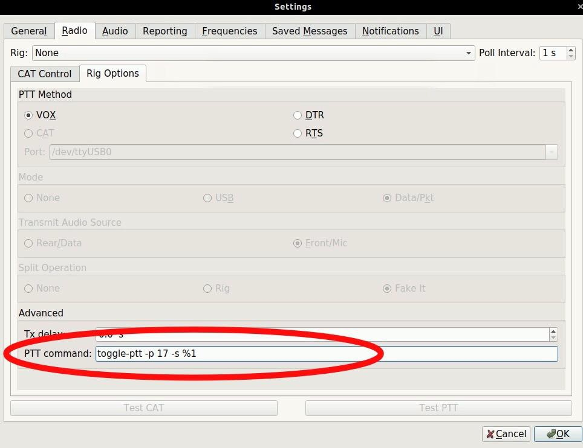

What this PTT command does is allow you to execute **any** command line script to toggle your Rig's PTT line.

In the above example, the toggle-ptt script will be called with the `-p 17 and -s parameters` on transmit. The `%1` in the above command will be replaced with "on" or "off" depending on the state of the PTT. If you do not add a `%1` in your command, "on" and "off" will be appended to the end of the command for invocation.

Example:

If you define your PTT command as: ``/usr/bin/ptt %1``

When JS8Call starts transmitting, it will execute: ``/usr/bin/ptt "on"``

And when JS8Call has finished transmitting, it will execute: ``/usr/bin/ptt "off"``

This is particularly helpful for Raspberry Pi / DRAWS when the GPIO ports are used to control your rig PTT. An example script can be found here: [https://gist.github.com/jsherer/dd09895ab23bdf571e2117cdd814c198](https://gist.github.com/jsherer/dd09895ab23bdf571e2117cdd814c198)

### Audio (Sound Card)

When choosing your sound card, you have the option to set individual devices for input and output. You'll need to find the device that matches what you've integrated with your rig. You can choose Mono or Stereo input/output, so try matching those with the capabilities of your device.

For best decoding, when configuring your audio devices you need to apply the right input/output levels:

1.  Make sure the sound card device you have chosen for input has no microphone amplification enabled Usually you set this at the operating system level. Set the input to 100%.

2.  Move your VFO to a quiet part of the band that has no signals present

3.  Set your rig's AF Gain to its maximum value

4.  Start adjusting your rig's RF Gain to the point where the s-meter just starts to read 0

5.  If RF Gain is not enough to bring down the rig's s-mete, apply your rig's attenuator. This is usual during noisy band conditions or RFI locally. Most attenuators apply a -10dB to -15dB signal attenuation, so you can usually bring RF Gain up just a touch to match.

6.  If those adjustments are still not enough, you're likely operating under an extremely noisy condition. You might have luck at this point to start playing with AF Gain to bring the input levels even further down to that sweet spot of 30-60dB as read by the meter in the app.

| | | |
|:-----:|:-----:|:-----:|
| Audio input is too low! | Audio input is just right! | Audio input is too high! |
|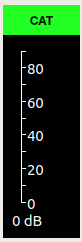|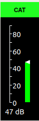 |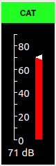|
<!-- TODO: Add Reporting (Spotting and API) section | assignee: @Aqueum -->

### Frequencies (Calling Frequencies and Band Hopping)

Most operators testing the application can be found +/- 4-8kHz from the standard FT8 frequencies. It is essential to avoid the main FT8 frequencies, as that will cause confusion among WSJT-X operators. Here are some suggested frequencies to use:

|         |           |          |          |          |         |      |
|--------:|-----------|----------|----------|----------|---------|------|
| **Band** | **Frequency** | **Hz** | | **Spacing** | **Above/below** | **Mode** |
| 160M | 1.842  | MHz | // | 2kHZ | above | FT8 |
|  80M | 3.578  | MHz | // | 5kHz | above | FT8 |
|  40M | 7.078  | MHz | // | 4kHz | above | FT8 |
|  30M | 10.130 | MHz | // | 6kHz | below | FT8 |
|  20M | 14.078 | MHz | // | 4kHz | above | FT8 |
|  17M | 18.104 | MHz | // | 4kHz | above | FT8 |
|  15M | 21.078 | MHz | // | 4kHz | above | FT8 |
|  12M | 24.922 | MHz | // | 9kHz | above | FT8 |
|  10M | 28.078 | MHz | // | 4kHz | above | FT8 |
|   6M | 50.318 | MHz | // | 5kHz | above | FT8 |
|   2M |144.178 | MHz | // | 4kHz | above | FT8 |

You might notice a few of these being close to the JT9 frequencies. Don't grab your pitchforks! JS8Call blocks out transmitting within the lower 500Hz of the passband. This leaves enough room for 25 simultaneous JT9 signals.

You might also notice that there are a few bands missing from this list. JS8Call does not make a recommendation for calling frequencies on 2200m, 630m, 60m, or higher than 2m, as many of these bands are special cases and have unique rules in many jurisdictions. It's up to the operator(s) to coordinate and determine the best frequency and operating pattern on these bands.

But also, please keep in mind these are only *suggested* frequencies. We all have VFOs, so please use them. Just remember to be good operators and prevent from interfering with other signals on our shared bands.

You **CAN** type in any frequency. JS8Call will not limit which frequencies you can manually transmit on. You can use the groups.io mailing list to schedule on other frequencies with test operators.

If you want to transmit on a non-standard frequency (recommended) you can either modify the frequencies list in the settings, or you can type directly into the band dropdown box in the top left of the screen.

<center>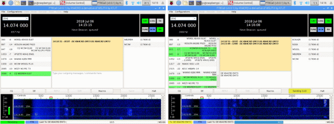</center>

If you'd like to add custom frequencies for JS8Call, you can do so in the settings:

<center>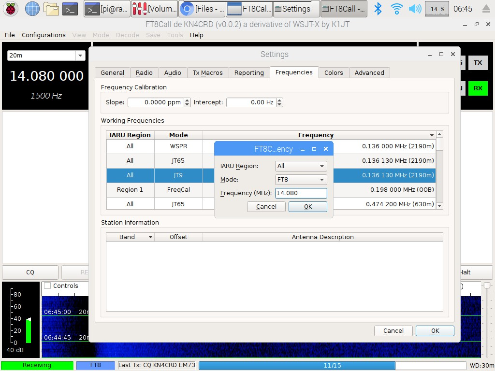</center>

If you'd like to reset to the suggested frequencies, right click the frequencies box and click Reset.

<center>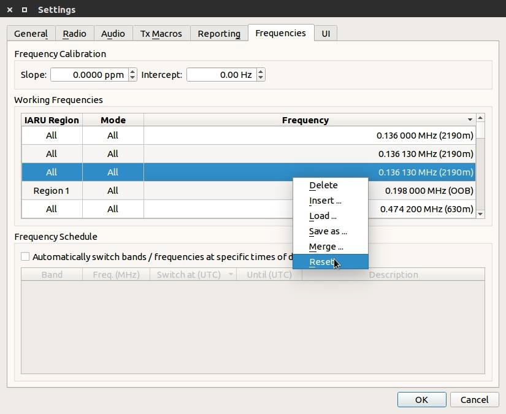</center>

### Saved Messages (Macros)

There are a few quick saved message buttons for transmitting common messages. You can edit these in the settings window. Just be mindful that long messages will take a while to send.

Saved messages have macro-like functionality. These are the macros variables (words that are surrounded by \<\> characters) that can be used in saved messages which will be replaced when sending the message:

```
  <MYCALL>     My Callsign
  <MYGRID4>    My 4 digit grid locator
  <MYGRID12>   My extended grid locator up to 12 digits
  <MYINFO>     My Station Information Message
  <MYCQ>       My CQ Message
  <MYHB>       My HB Message
  <MYREPLY>    My Reply Message
  <MYSTATUS>   My Station Status Message
  <MYVERSION>  My JS8Call Version
  <MYIDLE>     My Station Idle Time (no keyboard/mouse movement)
  <CALL>       Selected Callsign
  <SNR>        The SNR for the Selected Callsign
  <TDELTA>     The time delta for the Selected Callsign
```
- These macros also apply to configured messages like CQ, Reply, INFO, etc.
<!-- TODO: Add Notifications (Sound Alerts) section | assignee: @Aqueum -->
<!-- TODO: Add UI (Customize Colors and Font) section | assignee: @Aqueum -->

## Tips & Tricks

1.  - Be a good citizen...if you see a CQ you should try answering it before calling CQ yourself.
    - If you hear no CQs, call CQ!

2.  - An example QSO:

      - **→** ``KN4CRD: CQCQCQ EM73♢``

      - **←** ``DR4CNK: KN4CRD SNR +01 GOOD SIGNAL♢``

      - **→** ``KN4CRD: DR4CNK SNR -12 TU 4 CALL RIG IS KX2 5W DIPOLE♢``

      - **←** ``DR4CNK: KN4CRD RR -22 FB KX3 100W VERT♢``

      - **→** ``KN4CRD: DR4CNK RR FB REALLY ENJOYING THE CHAT MODE WITH LONG MESSAGES. BUT HEY LET'S TRY A RELAY ♢``

      - *... (and on, and on, if you want)*

      - **→** ``KN4CRD: DR4CNK 73♢``

      - **→** ``KN4CRD: @ALLCALL QRZ?♢``

3.  - You **do not** need to include your callsign when initiating your directed replies. They will be prefixed to your message automatically when you have a callsign selected in your heard list.

4.  - You do not have to reply on the same frequency offset as the caller. But, if you're calling another station off their frequency, you need to include their callsign at the beginning of the the message so it is directed to them and will show up in their yellow directed activity window.

5.  - Directed messages pack as much data as standard FT8 frames. The following examples are all 1 transmit cycle long

      - Example:

        - ``KN4CRD/P: CQCQCQ EM73`` (1 transmit frame)

        - ``VE3/KN4CRD: CQ QRP EM73`` (1 transmit frame)

        - ``KN4CRD: @ALLCALL?`` (1 transmit frame)

        - ``DR4CNK: KN4CRD SNR +15`` (1 transmit frame)

        - ``DR4CNK: KN4CRD AGN?`` (1 transmit frame)

6.  - For replying to a station's CQ, double click their call in the call activity window, then either choose a directed command or type a message to them:

      - ``DR4CNK: KN4CRD HW CPY?``

      - ``DR4CNK: KN4CRD SNR +12``

      - ``DR4CNK: KN4CRD YES``

      - ``DR4CNK: KN4CRD NO``

      - ``DR4CNK: KN4CRD RR``

      - ``DR4CNK: KN4CRD 73``

      - ``DR4CNK: KN4CRD HELLO MY FRIEND GREAT TO HEAR YOU!``

7.  - You can send free-text at any time! That's what JS8Call was inspired by:

      - ``HI JIM TU 4 CALL UR -12 INTO ATLANTA BTU DE KN4CRD`` (4 transmit frames)

    - It might be helpful to learn some of the morse code prosign/abbreviations and psk31 abbreviations:

      - [*https://en.wikipedia.org/wiki/Prosigns_for_Morse_code*](https://en.wikipedia.org/wiki/Prosigns_for_Morse_code)

      - [*https://www.qsl.net/ct2fzi/abreviations/abreviations.html*](https://www.qsl.net/ct2fzi/abreviations/abreviations.html)

      - Examples:

        - K - over

        - BTU - back to you

        - FB - fine business

        - HW? - how do you copy?

8.  - But, in general, you can just type words and sentences and let the code compress it efficiently.

      - Now, there *is* a word suggestion feature that marks up your transmission text while you are typing your message (like a spell check). It will mark words that do not appear in the code dictionary (often, weird abbreviations), because counterintuitively, using a lot of abbreviations will often result in LESS efficient transmission.

      - Example:

        - Say we transmit ``CONGRATULATIONS AND WELL WISHES FRIEND``. This compresses to 67 bits, for 20 words per minute and 1.76 bits per character (34 characters) in one transmit cycle.

      - But, let's say you want to be clever and use some weird abbreviations to help it transmit faster... ``CNGRATS ES WL WISHS FRND`` has 10 fewer characters. but compresses to 122 bits, for 10 words per minute and 5.08 bits per character. That's almost 2x the bits (and clearly IS 2x the number of transmit cycles)

9.  - JS8Call imposes minimal restrictions on you, the operator. It is up to you and you alone to abide by (or break) the rules of your license and jurisdiction.

## Frequently Asked Questions

  - What is considered a JS8 contact?
      - An amateur radio contact is a two-way exchange of information between two stations.

      - However, a contact is really what you make of it. It could be minimal information, it could be a 60 minute ragchew. If the contact is for an award or contest, then there are rules for what determines a valid contact.

      - Your callsign, a signal report, your name, your location, your rig details, what the weather is like, etc are all good things to communicate.

      - Keep in mind that the free-text nature of JS8 is what makes it valuable. You can exchange **any** information in your contact. If all you're exchanging is your grid and signal report, then FT8 is probably a better option for you.

  - What are the random three (or six) characters at the end of relay and acked message commands?

      - These are a checksum for the message added to ensure all of the message frames were delivered correctly before retransmitting / alerting. If received in its entirety by the receiving station, these checksums will not be displayed to them.

  - You said that all printable uppercase ASCII characters can be used. Do some take more time to send than others?

      - Yes. The characters that are sent in the messages are variable encoded, ranging from 3 to 19 bits in length based on their probability of being used in a sentence. The most common characters take the least amount of space, allowing us to send more than 13 characters per transmission cycle on average.

      - Example: `Space` and `E` are only 2.5 bits in length. You could send about 22 (!!) of them in a single transmission. Whereas a character like ``{`` is more like 14 bits in length, you could only send 4 of those. (But really, how frequently do you use that character?)

      - Here are some examples of phrases that could be sent in one 15 second transmit cycle:

        - ``EEEEEEEEEEEEEEEEEEEEEE`` (22 characters)

        - ``I HAVE EATEN A SHOE`` (20 words per minute)

        - ``WHICH WAY TO OHIO`` (16 words per minute)

        - ``NEVER HAVE I EVER`` (16 words per minute)

        - ``TU UR 599 4A GA`` (20 words per minute)

        - Etc

  - How fast does JS8Call transmit?

      - JS8Call normal mode uses the same 15-second transmission cycle as FT8. What is different is that due to the variable encoding of the characters, JS8Call can transmit up to 22 characters per transmission frame. For average sentences, JS8Call can pack words very tightly, at around 15 WPM.

      - Example:

        - ``WE HOLD THESE TRUTHS TO BE SELF-EVIDENT THAT ALL MEN ARE CREATED EQUAL THAT THEY ARE ENDOWED BY THEIR CREATOR WITH CERTAIN UNALIENABLE RIGHTS THAT AMONG THESE ARE LIFE LIBERTY AND THE PURSUIT OF HAPPINESS``

          - This phrase is 35 words. It would take 10 transmission cycles to send (2 minutes 30 seconds). That is about 14 WPM.

        - ``A SUCCESSFUL MAN IS ONE WHO CAN LAY A FIRM FOUNDATION WITH THE BRICKS OTHERS HAVE THROWN AT HIM``

          - This phrase is 19 words. It would take 5 transmission cycles to send (1 minute 15 seconds). That is just over 15 WPM.

        - ``THIS IS A TEST OF JS8``

          - This phrase is 6 words and takes 1 transmission cycle to send (15 seconds). That is 24 WPM.

      - Morse code has a neat way of calculating WPM, timing how long it takes to transmit the word PARIS. In JS8Call, PARIS is encoded into 17 bits (3.4 bits/character). Each transmission cycle can pack up to 69 character bits. That equates to about 16 WPM. (69/17=4.05 words / (15 seconds \* 4))

      - The app shows this in the status bar:

<center>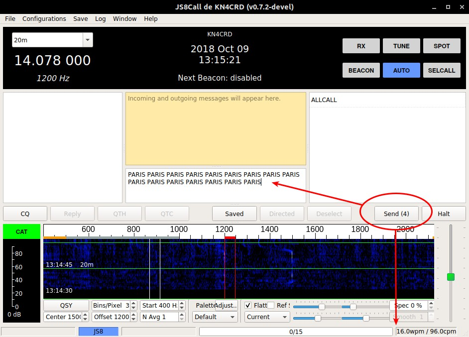</center>

  - Isn't 10-20 WPM too slow to have a conversation?

      - If propagation is good enough for a faster mode, you should be using it instead! But, with poor conditions like we have experienced at solar minimum, JS8Call might just be the best balance.

      - It may seem really slow (and it is, relatively speaking). However, FT8 modulation is able to decode (theoretically) down to -24dB below the 2500 Hz noise floor. Not many modes can say this, especially those which transmit at faster speeds. What does this mean? JS8Call may work when other modes cannot.

      - **We believe that communicating slowly is better than not communicating at all.**

  - What is the JS8Call Relay Challenge?

      - This is a friendly competition to maximize the number of continents one can pass a message back and forth to using the relay command.

      - We'll be giving away an award (and prize) to the first team of operators to successfully relay a message from one continent across three other continents (NA, SA, EU, AF, AS, OC, AN) and relay an ACK back to the original station using JS8Call. All you need to do is submit your logs from each station and optionally photographic/video documentation of your effort.

      - For example, this is what the outgoing and incoming messages could be:

        - ``KN4CRD\>LB9YH\>VK1MIC QSL?``

        - ``VK1MIC\>LB9YH\>KN4CRD QSL``

    - Does Heartbeat (HB) mode violate FCC 97.221 Automatically Controlled Digital Station rules in the United States?

      - For operators in the United States, here's a reference to the rules: [http://www.arrl.org/part-97-text](http://www.arrl.org/part-97-text)

      - With this, keep in mind:

        - The control operator is responsible for the station operation. The software makes a best effort to require a human to be present during operation (HB off by default, a watchdog timer feature built-in, etc). It is up to the operator to make sure they are in compliance with the rules of their jurisdiction.

        - Responses to directed queries by non-automatic stations fall under §97.221.C.1 exemption.

      - It is recommended that operators to turn off HB repetition when not at the station control point, but, they should feel comfortable leaving AUTO on while they are away since their station would only be responding to queries initiated by a non-automatic station.

  - Do message relays (\>) violate FCC 97.113.d rules in the United States?

      - For operators in the United States, here's a reference to the rules: [http://www.arrl.org/part-97-text](http://www.arrl.org/part-97-text)

      - Some background:

        - Repeater stations (definition 40) are stations which re-transmit radio signals simultaneously on a different frequency.

        - Message forwarding systems (definition 32) are explicitly allowed in FCC 97.219.

      - JS8 message relays **do not** automatically retransmit radio signals on the same or a different frequency. Doing so would make the function a repeater. Instead, the JS8Call software cooperates in a message forwarding system, creating a new message to be forwarded via *new* radio signals. These new signals include the original message, a checksum of the message, and the relay path back to the originating station.

  - Why isn't my station responding to @ALLCALL?

      - Previous versions of JS8Call (FT8Call) had a directed message of `@ALLCALL?` that had stations return SNR reports automatically. This has been replaced, starting in version 0.7 of JS8Call, with HB and ACKs. Stations will no longer respond to the "@ALLCALL?" query.

      - A similar query can be had by issuing: ``@ALLCALL QUERY CALL [callsign]?``

  - Why isn't my station acknowledging (ACK) other heartbeats (HB)?

      - You have to turn on HB Acknowledgements and have AUTO enabled to ACK other stations. This means, the order of operations are:

        - Turn on AUTO

        - Right click HB, select "Send Heartbeat Acknowledgements"

        - Your station will now ACK other heartbeats.

  - Can I run multiple copies of JS8Call side-by-side?

      - Yes! There is a -r/\--rig-name flag you can pass on the command line to give each instance a unique name. This creates a separate directory for your configuration and log files, so you can run multiple rigs at the same time.

        - You can do this by running js8call from the command line with this parameter, like:

          - js8call \--rig-name FT817

        - Or, if you are on Windows, create a shortcut for each unique name/config:

          - Create a shortcut to JS8Call on your desktop.

          - Right click and select properties.

          - Under the \"General\" tab edit the name of the shortcut with a unique name, like \"JS8Call FT817\".

          - Under the \"Shortcut\" tab add this to the target line.

          - Leave a space after .exe then \--rig-name=FT817 (replace FT817 with anything that uniquely identifies your rig)

          - Something like: ``C:\Program Files (x86)\js8call\bin\js8call.exe --rig-name=FT817``

  - Can I use group callsigns to run a net?

      - Yes! You would do so by announcing which group callsign your net will be using. If you do not want to use a custom group, @NET is sufficient.

      - All stations who will participate in the net will need to add the group callsign to their station configuration.

      - To facilitate fast check-ins, you can issue an SNR? command to the group and log the replying stations as checked-in.

  - What does the decoder sensitivity actually do?

      - Great question. Decoder sensitivity setting determines how much time will be spent on decoding during a decoding cycle. Each sensitivity level changes the behavior of the decoder somewhat:

      - - (1x) One Decode Pass - The decoder will do one pass using belief propagation and try to decode any signals it detects.

        - (2x) Two Decode Passes - The decoder will subtract any signals that were decoded in the first pass and try again.

        - (3x) Three Decode Passes - The decoder will perform three subtraction passes using belief propagation with ordered statistics

        - (4x) Four Decode Passes - The decoder will perform four subtraction passes using belief propagation with ordered statistics.

      - **NOTE**: You may have to run with a lower sensitivity if you have a low power machine or if your CPU cannot keep up with the decoder.

      - **NOTE**: Higher sensitivity levels that use ordered statistics have a higher chance of producing a "false decode" (i.e., noise that matches the sync pattern and passes the checksum process). This tradeoff is intentional. If you would like to avoid false decodes, you can decrease your sensitivity to 1x or 2x.

  - I love what you're doing. Do you have a PayPal or Patreon where I can send you a donation as a "Thank you?"

      - I appreciate the gesture! I continue to work on this project as a donation of my time to the Amateur Radio ecosystem. I'm not looking for payment of any kind. If you feel so obliged, however, I'd appreciate it if you instead sent along any donation you'd like to make to a local charity of your choosing. Something like the American Red Cross, Salvation Army, or even a local Amateur Radio club. They'd put that money to far better use!

  - What does Joe Taylor, K1JT (or the WSJT-X development team) think of JS8Call?

      - We have not heard anything from him/them, so you'll have to reach out and ask!

      - However, as you can see in the History section at the start of the document, I did receive acknowledgement from Joe before pursuing the JS8Call project back in February 2018:

<center>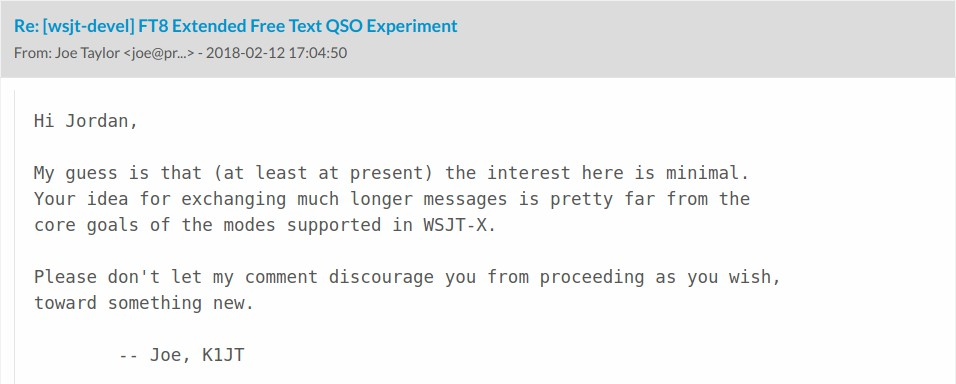</center>

via [https://sourceforge.net/p/wsjt/mailman/message/36224507/](https://sourceforge.net/p/wsjt/mailman/message/36224507/)

## Troubleshooting

If you're having trouble, head over to the troubleshooting chatroom for help: [https://js8call.groups.io/g/main](https://js8call.groups.io/g/main) or email Jordan directly: [kn4crd@gmail.com](mailto:kn4crd@gmail.com)

### Common Problems & Solutions

#### JS8Call will not run on my system

Make sure you are running a supported operating system, that you have disabled any programs that may be using your audio device, or preventing JS8Call from using the audio device...like an aggressive antivirus. If you're running Windows, and have a Windows Defender running, you'll need to either whitelist JS8Call or turn off the defender.

#### I see signals on the waterfall but I cannot decode them

Make sure the signals you are seeing are actually JS8Call signals and not FT8 signals (they are incompatible) by ensuring you're on one of the JS8Call frequencies. Make sure you are in Upper Sideband (USB) mode.

Make sure you have synchronized your clock to within 2 seconds of UTC. Make sure you're not running WSJT-X at the same time.

#### I do not see any signals on the waterfall

Check your incoming audio from your rig. Make sure JS8Call audio is configured correctly. That means allowing JS8Call to access the "microphone" in the system privacy settings and making sure the levels are set correctly.

Check to make sure you're on one of the JS8Call frequencies. Keep in mind that JS8Call is still in development and has more than *an order of magnitude fewer operators* on the air. There may actually be nobody on within your reception range. Check PSKReporter to see if there are others on the band. If you still cannot see any signals, either:

1)  You have an RX problem with your station 2)  None of the operators are operating on the band you are on 3)  Or propagation isn't being friendly to you

NOTE: Keep in mind that JS8Call isn't magic...we're still at the mercy of the ionosphere.

#### My rig won't transmit

Check your outgoing audio to your rig. Make sure JS8Call audio is configured correctly. Unplug the rig from the computer and hook up the output to a set of headphones or speakers. Try to transmit, maybe with the TUNE button in the app. Can you hear the tones? If not, then you have an audio problem, if so then you have a transceiver problem. Make sure your PTT is configured correctly for your rig or use VOX. You can test this in the settings. The PTT button will turn green if it can key your transmitter. If you have audio into the rig, but still have no RF out, make sure your rig is configured correctly by checking your digital gain / tx gain / mic levels.

After that, make sure your rig works...switch over to FM or CW and send a carrier to make sure the rig can actually transmit at all.

#### Bug Reports

You can send bug reports to Jordan Sherer (KN4CRD) at [kn4crd@gmail.com](mailto:kn4crd@gmail.com) or submit them to the issue tracker here: [https://github.com/JS8Call-improved/JS8Call-improved/issues](https://github.com/JS8Call-improved/JS8Call-improved/issues)

## API Definition

JS8Call uses a JSON API offered over UDP and TCP. More detailed documentation will be available in the future.

## Technical Implementation

JS8Call is under active development and details about the technical implementation are subject to change. Detail will be added here as the implementation stabilizes. Until then, the code is the source of truth for the implementation.

### Modulation

JS8Call uses JS8 modulation as the base transport for data. Being a derivative of WSJT-X, JS8Call heavily leverages the work by the WSJT-X Development Group on the FT8 mode.

|           |                 |                     |               |                              |
|-----------|-----------------|---------------------|---------------|------------------------------|
| **Speed** | **TX Duration** | **Tones / Symbols** | **Baud Rate** | **Tone Spacing / Bandwidth** |
| SLOW      | 25.28 seconds   | 8 / 79              | 3.125 baud    | 3.125Hz / 25Hz               |
| NORMAL    | 12.64 seconds   | 8 / 79              | 6.25 baud     | 6.25Hz / 50Hz                |
| FAST      | 7.9 seconds     | 8 / 79              | 10 baud       | 10Hz / 80Hz                  |
| TURBO     | 3.95 seconds    | 8 / 79              | 20 baud       | 20Hz / 160Hz                 |

Normal speed is the closest relative to FT8. It uses 3 blocks of 7 tones 7x7 Costas array for synchronization for backwards compatibility.

Fast, Turbo, and Slow speeds use 3 blocks of 7 tones with each block transmitting a unique 7x7 Costas array. This allows for more accurate synchronization.

Based on the modulation bandwidth and error correction, under AWGN with all else being equal:

  - Slow is 3dB more sensitive than Normal (+3dB)

  - Fast is 2dB less sensitive than Normal (-2dB)

  - Turbo is 3dB less sensitive than Fast and 6dB less sensitive than Normal (-6dB)

### Protocol

The JS8Call protocol sits at a layer above the base transport. Much of the implementation is inspired by the design document: [https://github.com/jsherer/ft8call](https://github.com/jsherer/ft8call) with a few deviations from the original proposal.

Messages in JS8Call are transmitted in intervals (frames), with each frame being classified as one of 6 frame types:

1.  Heartbeat

2.  Compound Callsign Partial

3.  Compound Callsign Directed Command

4.  Directed Command

5.  Data Huffman

6.  Data Dictionary

Further, each frame includes a transmission flag identifying it as:

1.  Default Frame (any frame)

2.  First Frame (first frame of the transmission)

3.  Last Frame (last frame of the transmission)

4.  Flag - Reserved (for future use) And finally, there are special encodings for:

    1.  Callsigns

    2.  Callsign Prefix/Suffixes

    3.  Signal Reports

    4.  Grids

#### Heartbeat

Heartbeat frames are comprised of:

  - Heartbeat Type (Heartbeat or CQ)

      - Compound Callsign

      - Grid

#### Compound Callsign Partial

Compound callsign partials are used as one-half of a 2-frame compound transmission when one of the stations includes a compound callsign. Compound callsign partials are always the 1st frame in a 2-frame compound transmission, encoding the "from" portion of a directed command with compound callsigns.

The frame includes:

  - Callsign

    - 4 character alphanumeric prefix or suffix (A-Z 0-9)

    - Grid or Numeric Value (SNR or PWR)

#### Compound Callsign Directed Command

Compound callsign directed commands are a special case for compound callsign partials where the numeric value encodes a directed command to be used with a compound directed message. It is one-half of a 2-frame compound transmission. Compound callsign directed commands are always the 2nd frame in a 2-frame compound transmission, encoding the "to" portion of a directed command with compound callsigns.

The frame includes:

  - Callsign

    - 4 character alphanumeric prefix or suffix (A-Z 0-9)

    - Directed Command

#### Directed Command

Standard callsigns can send a directed command in one frame.

The frame includes:

  - From Callsign

  - To Callsign

    - Directed Command

    - Numeric Value

#### Data

Data frames are the backbone for long-form messages in JS8Call. They are 75-bit frames that use a variable encoding to pack character data into the smallest transmission possible.

Data frames come in two flavors:

  - Uncompressed: All bits are used for character data using a huffman code

  - Compressed: The character data is compressed at the word level using an (s,c)-Dense Code

Data frames may need to include pad bits because of the variable encoding that character data uses for packing. The variable encoding used is a modified Huffman code that represents the most common characters (based on their frequency of observation in most texts) in fewer bits than less common characters, with the option to shift in alternate alphabets.

The complete modified Huffman code is located in Appendix A. The (s,c)-Dense Code tables include 260K compressible entities.

#### Callsigns

Callsigns are encoded in 28-bits as described in: EME 2000 - [http://www.ka9q.net/papers/eme-2000.ps.gz](http://www.ka9q.net/papers/eme-2000.ps.gz)

Compound callsigns are a 50-bit encoding of 11 characters following the format:

``\[@A-Z0-9/\]\[A-Z0-9/\]\[A-Z0-9/\]\[/\]\[A-Z0-9/\]\[A-Z0-9/\]\[A-Z0-9/\]\[/\]\[A-Z0-9/\]\[A-Z0-9/\]\[A-Z0-9/\]``

Since normal callsigns are 28-bits in length, and compound callsigns are 50-bits in length, and the payload size is only 75 bits, there\'s no way to transmit both in a single frame. So, when addressing a station with a compound call, the transmission is split into two frames, with any directed command included in the extra space of the second frame.

#### Callsign Prefix / Suffix

Prefixes and suffixes are 4 character alphanumeric encoded in 21-bits with a 1-bit flag to indicate whether or not it is a prefix or suffix. Alphanumeric digits can each be encoded in 5.25 bits (there are only 1,874,161 combinations of 4 character alphanumeric prefix/suffix, which is less than can be represented in a 21-bit number 2^21^ = 2,097,152)

#### Grids

Grids are encoded in 15-bits as described in:

[https://wsjt.sourceforge.io/wsjtx-doc/wsjtx-main-2.7.0.html#PROTOCOL_OVERVIEW](https://wsjt.sourceforge.io/wsjtx-doc/wsjtx-main-2.7.0.html#PROTOCOL_OVERVIEW)

## Future Work

JS8Call is an **experiment** in combining the robustness of FT8 with a messaging and network protocol layer for weak signal *communication*. The open source software is designed for connecting amateur radio operators who are operating under weak signal conditions and offers both real-time messaging, stored (inbox) messaging, message relay, and automatic station announcements.

There are many opportunities to explore reliable messaging in the future with the foundation laid, including:

  - [*SRARQ*](https://en.wikipedia.org/wiki/Selective_Repeat_ARQ) Selective Repeat Automatic Repeat Requests

      - Leveraging automatic frame repeats when lost during transmission

      - Selective repeats would allow for fewer transmissions than the current manual "AGN?" command.

  - [Store-and-forward](https://en.wikipedia.org/wiki/Store_and_forward) Routing

      - Automatic forwarding of stored messages to get the message "closer" to the destination

  - [Disruption-tolerant / Delay-tolerant Networking](https://www.nasa.gov/communicating-with-missions/delay-disruption-tolerant-networking/)

      - Using epidemic replication to converge a message to its destination automatically through extremely delayed and disconnected routes

  - Automatic Relay Routing

      - Using the network graph to be utilized for smart real-time routing to an intended destination

  - Callsign verification

      - Use public key checksumming for verifying the authenticity of the messages passed

  - Synchronization without an accurate timing requirement

      - This would also remove the need for frames to have a pause between them.

  - And more!

## Appendix A: Code Table

### Huffman Code:

**Character code weighted by frequency**

| | | | | | |
|:--------:|-------:|:--------:|-------:|:--------:|-------:|
| **Character Code** | **Frequency** | **Character Code** | **Frequency** | **Character Code** | **Frequency** |
| "\<space\> " | 01   | P | 1111011 | 4 | 11110101 |
| E | 100    | B | 1111001 | 9 | 11110100 |
| T | 1101   | . | 1110100 | 8 | 11110001 |
| A | 0011   | V | 1100101 | 6 | 11110000 |
| O | 11111  | K | 1100100 | 7 | 11101011 |
| I | 11100  | - | 1100001 | / | 11101010 |
| N | 10111  | + | 1100000 |
| S | 10100  | ? | 1011001 |
| H | 00011  | ! | 1011000 |
| R | 00000  | \ | 1010101 |
| D | 111011 | X | 1010100 |
| L | 110011 | 0 | 0010101 |
| C | 110001 | J | 0010100 |
| U | 101101 | 1 | 0010001 |
| M | 101011 | Q | 0010000 |
| W | 001011 | 2 | 0001001 |
| F | 001001 | Z | 0001000 |
| G | 000101 | 3 | 0000101 |
| Y | 000011 | 5 | 0000100 |

### (s,c)-Dense Code:

A whitepaper article is being written on this topic. In the meantime, see jsc.h, jsc.cpp, & jsc_map.cpp in the source repository for the complete dense code table.
